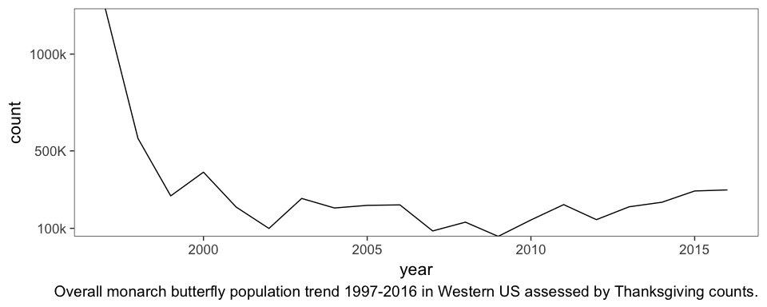

Monarch Butterfly population trends
================
Abram B. Fleishman
10/29/2017

Monarch Butterfly Population Trends in the Western U.S.
-------------------------------------------------------

These data are from thanksgiving counts made over the last 20 years (1997-2016) [available here](http://www.westernmonarchcount.org/wp-content/uploads/2014/10/WMTC-Data-1997-2016_updated-2.16.2017_website.xlsx).

I was currious about the monarch butterfly population trends in Lighthouse Field Park in Santa Cruz, CA and if the population has changed since I have been living in Santa Cruz. I noticed people counting burrterflies when I have walked by in the evenings and decided to search to see if I could find the data online. I did (see the link above).

The reson for my curriousity was that I last year it seemed like there were "way more" butterflies than I had seen over the past 6 winters, so naturally as any scienctist might, I wanted to get my hands on the data. I found some reports [online](https://static1.squarespace.com/static/53ac1211e4b0a7d6603b36c3/t/5601817de4b0f36f1e77635a/1442939261841/Monarch+Program+Report-+FY+14-15-+Final.pdf) but the figures were slightly dissapointing and did not show me exactly what I was interested in (the trends at Lighthouse Field).

``` r
  ggplot(monarch %>% 
           group_by(year) %>%
           summarise(count=sum(count,na.rm=T)) %>%
           arrange(year),
         aes(year,count))+
    geom_path( group="Total")+
  scale_y_continuous(expand = c(0,0),
                     breaks = c(50000,100000,500000,1000000),
                     labels = c("50k","100k","500K","1000k"))+
  labs(caption="Overall monarch butterfly population trend 1997-2016 in Western US assessed by Thanksgiving counts.")+
  theme_bw(base_size = 16)+
  theme(panel.grid = element_blank(),
        plot.caption = element_text(hjust = 1))
```



I noticed that the population declinded steeply during the first few years of data, but after that it seems to bounce around some new "stable" population size, but may be increasing over the past 10 years or so.

``` r
  ggplot(monarch %>% 
           filter(year>1998) %>% 
           group_by(year) %>%
           summarise(count=sum(count,na.rm=T)) %>%
           arrange(year),
         aes(year,count))+
    geom_point( )+
  geom_smooth(method = 'loess',color="black")+
  scale_y_continuous(expand = c(0,0),
                     breaks = c(0,100000,500000,1000000),
                     labels = c("0","100k","500K","1000k"))+
  labs(caption="Overall monarch butterfly population trend 1999-2016 in Western US assessed by Thanksgiving counts.")+
  theme_bw(base_size = 16)+
  theme(panel.grid = element_blank(),
        plot.caption = element_text(hjust = 1))
```


When plotted by county, it is clear that 4 counties make up the majority of the population and the decline. Infact,

``` r
counties<-monarch %>% 
           group_by(year,COUNTY) %>%
           summarise(count=sum(count,na.rm=T)) %>%
           arrange(COUNTY,year)
  ggplot(counties,
         aes(year,count,group=COUNTY,color=COUNTY))+
  geom_path(method = 'loess',size=1)+
  scale_y_continuous(expand = c(0,0),
                     breaks = c(0,50000,100000,200000,300000),
                     labels = c("0","50k","100k","200K","300k"))+
  labs(caption="")+
  theme_bw(base_size = 16)+
  theme(panel.grid = element_blank(),
        plot.caption = element_text())
```

    ## Warning: Ignoring unknown parameters: method

 Overall monarch butterfly population trend 1997-2016 in Western US assessed by Thanksgiving counts.

``` r
big_counties<-monarch %>% 
  filter(COUNTY%in%c("Santa Cruz", "San Luis Obispo", "Santa Barbara", "Ventura")) %>% 
           group_by(year,COUNTY) %>%
           summarise(count=sum(count,na.rm=T)) %>%
           arrange(COUNTY,year)

little_counties<-monarch %>% 
  filter(!COUNTY%in%c("Santa Cruz", "San Luis Obispo", "Santa Barbara", "Ventura")) %>% 
           group_by(year,COUNTY) %>%
           summarise(count=sum(count,na.rm=T)) %>%
           arrange(COUNTY,year)
  
ggplot(big_counties,
         aes(year,count,group=COUNTY,color=COUNTY))+
  geom_path(method = 'loess',size=1)+
  scale_y_continuous(expand = c(0,0),
                     breaks = c(0,50000,100000,200000,300000),
                     labels = c("0","50k","100k","200K","300k"))+
  labs(caption="Overall monarch butterfly population trend 1997-2016 in Western US assessed by Thanksgiving counts.")+
  theme_bw(base_size = 16)+
  theme(panel.grid = element_blank(),
        plot.caption = element_text(hjust = 1))
```

    ## Warning: Ignoring unknown parameters: method


``` r
ggplot(little_counties,
         aes(year,count,group=COUNTY,color=COUNTY))+
  # geom_path(method = 'loess',size=1)+
  geom_smooth(method = 'loess',size=1)+
  scale_y_continuous(expand = c(0,0),
                     breaks = c(0,50000,100000,200000,300000),
                     labels = c("0","50k","100k","200K","300k"))+
  labs(caption="Overall monarch butterfly population trend 1997-2016 in Western US assessed by Thanksgiving counts.")+
  theme_bw(base_size = 16)+
  theme(panel.grid = element_blank(),
        plot.caption = element_text(hjust = 1))
```


